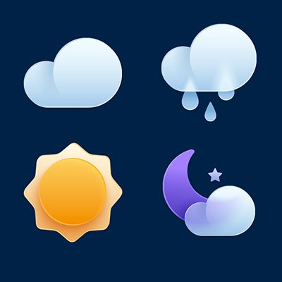

# Today's Weather Wonderland Web Application

# Table of Contents
- [Overview](#overview)
- [Features](#features)
  - [themeToggle.js](#themetogglejs)
  - [weatherLoader.js](#weatherloaderjs)
- [Learning Outcomes (From a Student's Perspective)](#learning-outcomes-from-a-students-perspective)
- [User Stories](#user-stories)
- [Design Elements](#design-elements)
- [User Flow](#user-flow)
- [Task Flow](#task-flow)
- [Usability Testing](#usability-testing)
- [File Structure](#file-structure)
- [How to Use](#how-to-use)
- [APIs and External Libraries](#apis-and-external-libraries)
- [Customization](#customization)
- [Browser Compatibility](#browser-compatibility)
- [Contribution](#contribution)
- [License](#license)
- [Deployment](#deployment)

## Overview
Today's Weather Wonderland is a web application that displays real-time weather information for any city. It offers features like toggling between dark and light themes, and switching temperature units between Celsius and Fahrenheit. The app uses the OpenWeatherMap API for fetching weather data.

## Features
- **Theme Toggle**: Users can switch between a light and dark theme.

- **Temperature Unit Toggle**: Users can toggle the temperature display between Celsius and Fahrenheit.

- **City Search**: Enter a city name to fetch and display its current weather conditions.

- **Geolocation Support**: Automatically fetches weather data based on the user's current location.

### themeToggle.js
Manages theme toggling between dark and light modes.

### weatherLoader.js
Contains functionality for fetching and displaying weather data.

## Learning Outcomes (From a Student's Perspective)
As a student, working on this project helped me understand real-world applications of JavaScript, especially in fetching and handling data from external APIs like OpenWeatherMap. I learned how to implement geolocation services, toggle functionalities for theme and temperature units, and dynamically update the UI. Additionally, I gained experience in responsive web design using Bootstrap and enhanced my problem-solving skills through debugging and validating user inputs.

## User Stories
1. **Weather Enthusiast**: Wants to quickly check the weather for different cities.
2. **Travel Planner**: Needs to know the current weather of destinations for planning trips.
3. **Student**: Uses the app to learn about weather patterns in various global cities.

## Design Elements

- **Layout**: Clean and intuitive interface, with a focus on usability.
- **Color Scheme**: Contrasting colors for the dark and light themes to ensure readability.
- **Icons and Imagery**: Weather-related icons for a more engaging user experience.

## Learning Outcomes
1. **API Integration**: Learned how to integrate and fetch data from the OpenWeatherMap API, understanding the nuances of working with external data sources in a real-world application.
2. **JavaScript Proficiency**: Improved my JavaScript skills, particularly in handling asynchronous requests, DOM manipulation, and event handling which are crucial for dynamic web applications.
3. **Responsive Web Design**: Enhanced my understanding of responsive design principles using Bootstrap. This project helped me appreciate the importance of building applications that provide a seamless experience across various devices.
4. **Geolocation Functionality**: Gained hands-on experience in implementing geolocation functionality, understanding how to use browser-based APIs to enhance user experience.
5. **User Interface (UI) Development**: Developed skills in UI design, learning how to create an intuitive and engaging interface that enhances user interaction and experience.
6. **Debugging and Problem Solving**: Improved my debugging skills by identifying and fixing issues related to API responses, UI elements, and browser compatibility.
7. **Version Control and Project Management**: Gained experience in using Git for version control, which is essential for collaborative development and managing larger projects.
8. **Attention to User Feedback**: Learned the importance of user feedback in the development process, understanding how to iterate on the product based on usability testing and user suggestions.

## User Flow
1. User opens the web application.
2. Optionally toggles between the dark and light theme.
3. Searches for a city or uses geolocation for local weather.
4. Views the weather details and switches temperature units if needed.

## Task Flow
1. **Theme Toggling**: Click the theme toggle button to switch modes.
2. **Searching for Weather**: Enter a city name and click "Search" or use geolocation.
3. **Switching Temperature Units**: Click the unit toggle to switch between Celsius and Fahrenheit.

## Usability Testing
Usability testing with five users highlighted the application's ease of use and effective design. Suggestions included adding a 5-day weather forecast and improving the responsiveness of the city search function for a better mobile experience.

## File Structure
- **HTML File (index.html)**
- **CSS Files**
- **JavaScript Files**: `themeToggle.js` and `weatherLoader.js`

## How to Use
1. **Open the Web Application**
2. **Toggle Theme**
3. **Search for a City**
4. **Toggle Temperature Units**

## APIs and External Libraries
- **OpenWeatherMap API**
- **Bootstrap**
- **Font Awesome**

## Customization
- **API Key**: Replace with your own in `weatherLoader.js`.
- **Styling**: Modify `css/styles.css` for custom design.

## Browser Compatibility
Compatible with Chrome, Firefox, and Edge.

## Contribution
Open to contributions. Please maintain coding standards and documentation.

## License
Open-sourced under the LICENSE file.

## Deployment
The application can be easily deployed on GitHub Pages by pushing the project to a GitHub repository and enabling GitHub Pages in the repository settings. This makes the application accessible via a URL provided by GitHub.
